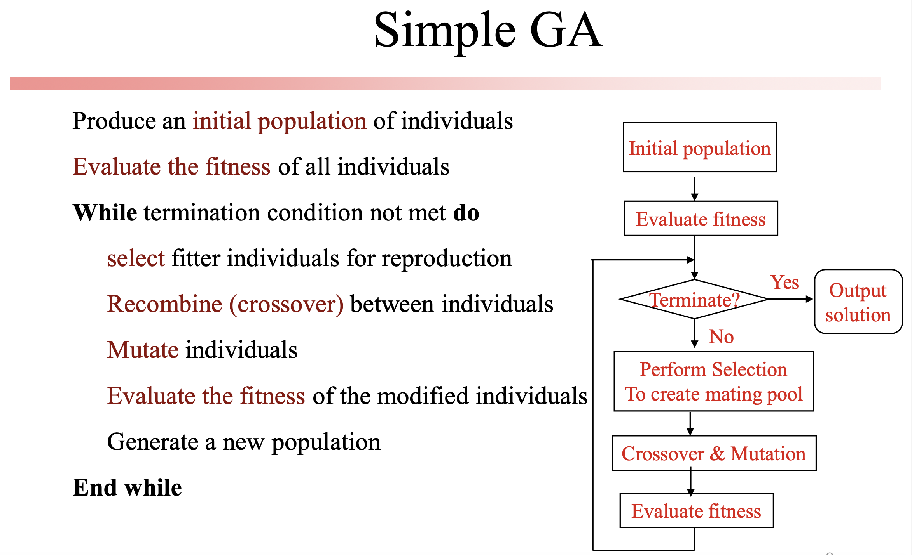

# Simple Genetic Algorithm (SGA)

## Prerequisite

[Genetic Algorithm](https://www.geeksforgeeks.org/genetic-algorithms/)

## Introduction

Simple Genetic Algorithm (SGA) is one of the three types of strategies followed in Genetic algorithm.

1. SGA starts with the creation of an initial population of size N.
1. Then, we evaluate the goodness/fitness of each of the solutions/individuals.

After that, the convergence criterion is checked, if it meets then we converge the algorithm otherwise go for the next steps –

1. Select Np individuals from the previous population.
1. Create the mating pool randomly.
1. Perform [Crossover](https://www.geeksforgeeks.org/crossover-in-genetic-algorithm/).
1. Perform Mutation in offspring solutions.
1. Replace the old solutions of the last generation with the newly created solutions and go to step (2).

## Important Parameters while solving problems in Simple Genetic Algorithm

1. Initial Population N
1. Mating pool size Np
1. Convergence threshold
1. Crossover
1. Mutation
1. Inversion

## Features

1. Computationally Expensive
1. Biased towards more highly fit individuals
1. Performs well when the initial population is large enough.

## Applications

1. Learning robot behaviour using Simple Genetic Algorithm.
1. In the finance industry.
1. Neural networks.
1. Soft computing Applications like Fuzzy logic, Neurocomputing.
1. Optimization problems.
